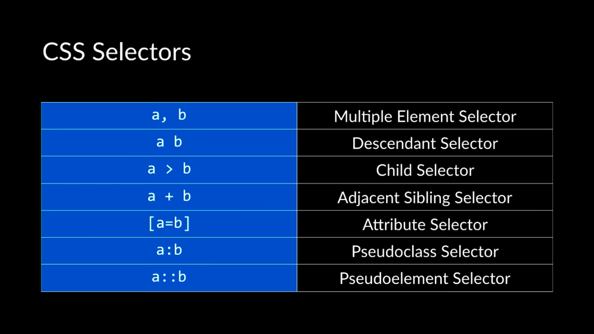

# CS50's Web Programming with Python and JavaScript

This class includes a lot of overviews of HTML, CSS and Python programming language.

The advantage of this series is understanding each programming language quickly. And then according to your interest and master it.

So we just got a whirlwind tour of the Python programming language.


## Launching IDE from the Command Line

`atom .`

這一頁有講到，可以搜尋 atom .：[http://flight-manual.atom.io/getting-started/sections/atom-basics/](http://flight-manual.atom.io/getting-started/sections/atom-basics/)

喚醒 VS Code 的指令

```text
code .
```

[https://code.visualstudio.com/docs/setup/mac](https://code.visualstudio.com/docs/setup/mac)

[Lecture 0 - Git](https://www.youtube.com/watch?v=1u2qu-EmIRc)

[Lecture 1 - HTML, CSS ](https://www.youtube.com/watch?v=XQs5KcUj-Do)


## 功能實作

* 實作 [setupBasicLink.html](https://github.com/jeffrey1183/pm-coding/tree/master/My%20Practice)，怎麼設定連結，連結可以連到內頁，也可以連到其他網站像 Google。或是連到同一頁的其他區塊。

> Use ID jumping to the section I want in same page link to different sections in the same page

* 設定輸入格的設定樣式
  * 練習檔案
    *  defendant selector.html 
    * immediate\_selector.html
    * attribute\_selector.html
* 當滑鼠 hover 到按鈕上會變顏色
  * 實作檔案
    * hover.html
* 要在所有連結前面加上「指定文字」，例如所有的連結都要是 Click me 開頭
* 當用戶反白某一段文字時，字的顏色變成紅色，背景變成黃色
  * selector.html
* 實作 flexbox
  * 學習 [CSS element&gt;element Selector](https://www.w3schools.com/cssref/sel_element_gt.asp)
    * 有一個 div class 叫 container，我可以選取在他底下的 div 設定樣式 
* 實作 grid
  * grid.html
  * 相關知識：什麼是 [Viewport](https://www.w3schools.com/Css/css_rwd_viewport.asp)，用 media query 去調大小
    * 用到 CSS 的 [display property](https://www.w3schools.com/cssref/pr_class_display.asp) 之中的 grid, 
    * [設定 grid-column-gap](https://www.w3schools.com/cssref/pr_grid-column-gap.asp)
    * [設定 grid-row-gap](https://www.w3schools.com/cssref/pr_grid-row-gap.asp)
    * [設計 grid-template-columns](https://www.w3schools.com/cssref/pr_grid-template-columns.asp)
      * This is what allows me to specify how wide I want each column to be.
      * 可以設定每一欄的大小，也可以用 auto 表示自動伸

### Media Query

透過 media queries 控制一段文字在用印表機列印時不要出現

* 創作一個 screen-only 的 class
* 實作檔案
  * print.html

實作 Responsive

* 透過 media queries ，當超過一定寬度時背景顏色改變
  * 實作檔案：responsive0.html
* 透過 media queries，當超過一定寬度時文字改變
  * 實作檔案：responsive1.html


### Media Queries

* [W3C 教學](https://www.w3schools.com/cssref/css3_pr_mediaquery.asp)，介紹 media types 和 media features
* [stack overflow 案例](https://stackoverflow.com/questions/8549529/what-is-the-difference-between-screen-and-only-screen-in-media-queries#_=_)
* viewport 是什麼？[手機螢幕尺寸是對角線](https://kknews.cc/zh-tw/digital/enmyxby.html)


* [CSS pseudo-elements 參考資料](https://www.w3schools.com/css/css_pseudo_elements.asp)
  * pseudo-class is a special state of an HTML element which is for interacting with that web page. For example, when we hover over a button, it becomes another color we saw.
  * 說明 ::before Pseudo-element
* [CSS content Property](https://www.w3schools.com/cssref/pr_gen_content.asp) 會跟 [::before](https://www.w3schools.com/cssref/sel_before.asp)  和 [::after](https://www.w3schools.com/cssref/sel_after.asp) pseudo-elements 一起使用，產生頁面上的內容

## Bootstrap

* And one of the most popular libraries is called Bootstrap.
* We can use them in order to make our lives easier when it comes to making our websites mobile-responsive, for example.
* 要安裝 bootstrap 才能在本機端看到變化

先在 HTML 檔案裡面設定 bootstrap 的 link，可以從 [Getting Started](https://getbootstrap.com/docs/3.3/getting-started/) 找，如果 link 內的版本有問題，預覽就失敗。

先做了 2 個檔案，去做比較：

* nobootsrap.html
* bootstrap.html

column1.html

* 練習不同尺寸要用不同的 class\(col-lg-3, col-sm-6\)
* 一般來說自己定義的 class 會避免與 bootstrap 相同，如果用相同的 class ，就看誰訂的細

alert.html

* 練習用 [alert](https://v4-alpha.getbootstrap.com/components/alerts/?)

想要知道更多 components 就到 bootstrap.com 的 documents


## Sass

當 stylesheet 越來越複雜

we're going to do now is introduce an entirely new language which is built on top of CSS called Sass.

And what Sass is is it's an extension to CSS that gives us a little more power and a little more flexibility when

檔名是叫 scss

all variables in Sass begin with a dollar sign

So what we need to do is take this SCSS file, this Sass file, and convert it into a CSS file.

寫好 scss 之後再轉成 css 檔案

```text
$ sass variables.scss variable.css
```

用 scss 的好處就是修改很方便，修改完要 recompiler

要自動 compile

```text
sass --watch variables.scss:variable.css
```

要 install scss 才能在本機端看到變化， Github 本身支援自動轉換

GitHub Pages included, have built-in support for Sass such that if you push an SCSS file to GitHub Pages in project 0, for instance,

GitHub will automatically take care of the process of compiling that Sass file from a .scss file to a .css file such that when someone goes to your website,

you'll need to install Sass in order to make any of that-- the command line sass command work that does the compilation from SCSS files to CSS.

很重要的問題：how does Sass work when we're dealing with multiple different files? Sass has a built-in command that actually lets you import existing CSS from a different file into a Sass file.

So there's built-in support for multi-file stylesheets built into Sass. If you go to the Sass website, you'll find examples of how they're able to incorporate different files into the same file in order to use variables that are defined in a different file in a separate stylesheet.

問題：那到底 HTML 的的 link tag 要連去 css 還是 scss 的檔案？

We always want to link the CSS file, because the CSS file is the only one that the browser actually understands. Google Chrome, out of the box, doesn't know how to take a Sass file and understand what the variables mean. It only understands the CSS file.

倒數第二段

one other feature that's very helpful is nesting different CSS selectors within each other.

最後一段

But the last one that we'll take a look at today is the concept of inheritance.


[hex value for unicode symbol](https://www.fileformat.info/info/unicode/char/21d2/index.htm)





## Flask

Today what we're going to do is we're going to take the next step and start building some dynamic web applications using a programming language called Python in order to build web applications that are a little more powerful than what we can have just by describing the contents of a web page using HTML, for instance.


hello.py

* What is function and argument
* How to run a Python file

name.py

* 第一行是把用戶輸入的資料變成一個變數
* 第二行的 f 是 Python 3.6 版之後的新功能，稱做 format string
  * begins with the letter F. This is a new feature of Python version 3.6--

### 安裝 Anaconda 後

安裝後，電腦會預設使用的默認的 Python 是 Anaconda 附帶的 Python。


建立 python 36 的環境

```text
JunyuandeMacBook-Air:~ junyuanwang$ conda create --name python36 python=3.6
Fetching package metadata .......
Solving package specifications: ..........

Package plan for installation in environment //anaconda/envs/python36:

The following packages will be downloaded:

    package                    |            build
    ---------------------------|-----------------
    xz-5.2.3                   |                0         225 KB
    zlib-1.2.11                |                0          98 KB
    python-3.6.2               |                0        11.7 MB
    certifi-2016.2.28          |           py36_0         213 KB
    wheel-0.29.0               |           py36_0          87 KB
    setuptools-36.4.0          |           py36_1         559 KB
    pip-9.0.1                  |           py36_1         1.7 MB
    ------------------------------------------------------------
                                           Total:        14.6 MB

The following NEW packages will be INSTALLED:

    certifi:    2016.2.28-py36_0
    openssl:    1.0.2l-0
    pip:        9.0.1-py36_1
    python:     3.6.2-0
    readline:   6.2-2
    setuptools: 36.4.0-py36_1
    sqlite:     3.13.0-0
    tk:         8.5.18-0
    wheel:      0.29.0-py36_0
    xz:         5.2.3-0
    zlib:       1.2.11-0
```

列出你的環境

```text
conda env list
```

Python 環境設定

* [參考 1](https://foofish.net/anaconda-install.html)
* [參考 2](https://www.zhihu.com/question/58033789)

variable.py

* python 不用設定變數型態
* Note that I never told my program that i is going to be an integer, or f is going to be a floating point number, or b is going to be a Boolean value.
* Python figures this out for itself.
* When I say i equals 28, Python knows that if I'm assigning the number 28 to i, then i must be in integer value. And so if you're familiar with other languages like C or Java, where you're used to having to explicitly write out the name of the type for any particular variable, know that Python doesn't require you to do that, and just lets you take a variable and assign it to any given value without needing to specify explicitly what the type of that value actually is.

## Indentation

The indentation in Python is actually required. Unlike several other programming languages where indentation is a style thing.

it's not strictly necessary, in Python this indentation is necessary.

[秘笈](https://www2.cs.arizona.edu/people/mccann/errors-python)


Python is very good at also supporting storing sequences of data where we have multiple values that are combined together under one name.

* sequence.py

### Python Interpretor

Just type Python in the command line. You've opened up the Python interpreter. which is a place where I can line at a time type of line of Python code and immediately see the result.

用 quit\(\) 離開

### Loops

loops0.py

loops1.py

* the question is, do sequences need to be all of the same data type?
* The short answer is no. it's a good idea if different things in the list are of the same type.
* 我們沒辦法去記哪一個位置是什麼 data type，全部一樣會比較好處理

sets.py

dictionaries.py

functions.py

* define a new function, this is a slightly older way of plugging in values into Python strings.
* [string format](https://www.programiz.com/python-programming/methods/string/format) 
* 自定義一個 function 為輸入數字的平方，要先定義過後才能使用

modules.py

* 如何引用 function，並且指定某個 function
* 為了避免沒有要用的 function 也執行，在 functions.py 裡建立 main function


classes.py

* define a new class and create a object
  * 參考資料：[https://www.w3schools.com/python/python\_classes.as](https://www.w3schools.com/python/python_classes.asp)p 包含什麼是 self

## HTTP

If I type google.com and press Return, I'm sending an HTTP request to Google's server. Google's server receives that request, needs to figure out some way to interpret that request.

## Flask

And so what we're going to be doing now as we go about building web applications, is writing code that will take care of that server side processing. Receiving requests, figuring out what those requests they're dealing with and what they're asking for, and figuring out what response to then give back to the user.

And in order to do that, we're going to be using flask. Flask as a micro framework written in Python.

What that effectively means is that flask is some code already written for us in Python that makes it easy to get up and running with a simple web application that has a lot of features that can be useful as we go about developing web applications, as we'll soon see in a moment.

application.py

* main file of application
* command line 要輸入  `flask run`

結果出現 Error: Could not locate Flask application. You did not provide the FLASK\_APP environment variable.

這是因為 flask relies on what's called an environment variable, a variable that's set inside of your terminal to know what file to be looking for as the source of the application. If you're running for the first time, you  need a line like export flask underscore app equals application dot py. And all that line is doing is saying set the environment variable flask app to be application dot py.

```text
export FLASK_APP=application.py
flask run
```

In other words, tell flask that the file that I want to run this application from is a file called application do py, which is just the general convention.

如果在跑 flask 時出現

WARNING: Do not use the development server in a production environment.

可以參考：[https://stackoverflow.com/questions/50284753/warning-message-while-running-flask](https://stackoverflow.com/questions/50284753/warning-message-while-running-flask)

不用理他


How to import Python modules?

* [https://www.w3schools.com/python/python\_modules.asp](https://www.w3schools.com/python/python_modules.asp)

如果只要輸入部分 module 就會用到 from


設定不同的 route 回傳不同的文字

* route0/application.py


route1/application.py

* app route [官方教學](http://exploreflask.com/en/latest/views.html)
* Say hello to anyone 在不同的 route 裡
* 學習怎麼用 Formatted string literals，[第二個回答](https://stackoverflow.com/questions/2960772/how-do-i-put-a-variable-inside-a-string-in-python)
* 要切到要執行的資料夾再跑 flask run
* [capitalize method ](https://www.tutorialspoint.com/python/string_capitalize.htm)
  * Capitalizes the first letter of it


### Render HTML File

How to tie those html files into flask? Tell flask to use those html files that we've already created in order to return something back to the user.

Let's import a function in flask called render\_template to solve it.

* [官方教學](http://flask.pocoo.org/docs/1.0/quickstart/#rendering-templates)

templates folder

* import template\_rener 和使用 render\_template
* 另外寫一個 index.html 的檔案，讓 flask render
* 要注意資料夾結構，在 templates 裡面再塞了一個 templates ，才放 index.html。application.py 另外放。
  * 這跟 how does flask find index.html, Where does it know to look? 
  * Flask is only going to look immediately inside of a subdirectory called templates. 所以我們的資料夾才要這樣放。


Let's try and use Python to begin to add some new features to this website


variable0

* The text in HTML is dynamically generated, rendered by flask, depending upon what I pass into it as variables
* [如果資料夾的架構有問題](https://stackoverflow.com/questions/15053790/jinja2-exceptions-templatenotfound-error)
* what is this double curly brace index? In fact, it's entirely different, what's called a templating language, an entirely separate language called Jinja1, which is a standalone language. But it's a language that flask uses in its html templates in order to make it easy to dynamically generate web pages. And so we'll see a couple of examples of this Jinja2 syntax.
* 當 route 是 bye 的時候，畫面顯示指定的文案
* Does this Python file come as back end? Yes, What I've written here is Python code for a back end web server, that is listening for a request like, me typing in URL slash bye. It processes that request and returns some response, in this case the HTML. So yes, this back end Python code as you would term it.


codition.py
* import python module datetime to get the current date.
* [import 的語法](https://medium.com/pyladies-taiwan/python-%E7%9A%84-import-%E9%99%B7%E9%98%B1-3538e74f57e3)，包含為何要寫 
* [jinja 2 syntax](http://jinja.pocoo.org/docs/2.10/templates/#list-of-control-structures)
```python
now = datetime.datetime.now()
```
* Question: So why did I put the if else inside the index.html instead of inside of the Python code?
 * I certainly could have put it inside the Python code.
* Question: Do you need to install Jinja2 in order to make any of this work?
 * What you will need to do is you'll need to install flask, which is the micro framework that we've been using in order to generate these web applications. And when you install flask, Jinja2 come along with it.


## SQL

And in particular, trying to find some way to use databases to make it easier for our web applications to store and manipulate and use data ultimately.

And the types of databases that we're going to be talking about today, are relational databases. Which you can think of as effectively storing data inside of a table.


Designing these sorts of tables, but we're going to do so using technology called SQL, or S-Q-L. Structured query language, which is a language designed to allow us to very easily interact with databases.

Interact with tables of data that have rows and columns, for instance.


### PostgreSQL

create.sql

* 以飛機航班當作例子
* syntax of creating a [table](https://www.w3schools.com/sql/sql_create_table.asp)
* [Primary key](https://www.w3schools.com/sql/sql_primarykey.asp)
  * A table can have only one primary key, which may consist of single or multiple fields.
  * And then primary key just means this is the primary way via which I'm going to reference a flight. That every flight is going to have a unique ID. And therefore, if I tell you ID number 28, that will map to one and only one flight.
* VARCHAR
  * text
* [NULL Value](https://www.w3schools.com/sql/sql_null_values.asp)
  * A field with a NULL value is a field with no value.
  * A NULL value is different from a zero value or a field that contains spaces. A field with a NULL value is one that has been left blank during record creation!
* NOT NULL
  * column doesn't necessarily need to have a value, but can have a value if you wanted to.

[Postgres Guide](http://postgresguide.com/setup/install.html)

* 可以下 command 連到線上資料庫
* \d 顯示 table

### [Constraints](https://www.w3schools.com/sql/sql_constraints.asp)

* [**NOT NULL**](https://www.w3schools.com/sql/sql_notnull.asp) - Ensures that a column cannot have a NULL value
* [**UNIQUE**](https://www.w3schools.com/sql/sql_unique.asp) - Ensures that all values in a column are different
* [**PRIMARY KEY**](https://www.w3schools.com/sql/sql_primarykey.asp) - A combination of a NOT NULL and UNIQUE. Uniquely identifies each row in a table
* [**FOREIGN KEY**](https://www.w3schools.com/sql/sql_foreignkey.asp) - Uniquely identifies a row/record in another table
* [**CHECK**](https://www.w3schools.com/sql/sql_check.asp) - Ensures that all values in a column satisfies a specific condition
* [**DEFAULT**](https://www.w3schools.com/sql/sql_default.asp) - Sets a default value for a column when no value is specified
* [**INDEX**](https://www.w3schools.com/sql/sql_create_index.asp) - Used to create and retrieve data from the database very quickly

insert.sql

* Inserting Data into Table
* [官方](https://www.w3schools.com/sql/sql_insert.asp)


how to reading data from a database

*  select is a query that is meant for reading from a database. I already have rows in the database, and now I care about accessing those rows.
* [select](https://www.w3schools.com/sql/sql_select.asp) 
* [select where](https://www.w3schools.com/sql/sql_where.asp)

psql command

* [安裝](https://medium.freecodecamp.org/how-to-get-started-with-postgresql-9d3bc1dd1b11)
* [heroku](https://www.heroku.com/postgres)


SQL Functions

* SUM
* COUNT
* MIN
* MAX
* AVG


計算有幾列

* 可以搭配 WHERE 使用
* [SQL In](https://www.w3schools.com/sql/sql_in.asp)
* [SQL WHERE](https://www.w3schools.com/sql/sql_where.asp)
* [SQL LIKE](https://www.w3schools.com/sql/sql_like.asp)

```text
SELECT COUNT(*) FROM flights;
```


Update Query

* What if that data needs to be updated or changed?

```sql
UPDATE flights
    SET duration = 430
    WHERE origin = `New York`
-- where is telling me which rows I want to update. Not all of rows
    AND destionation = `London`
```


DELETE Query

```text
DELETE FROM countries
    WHERE destination = `Tokyo`
```


看到 31分

