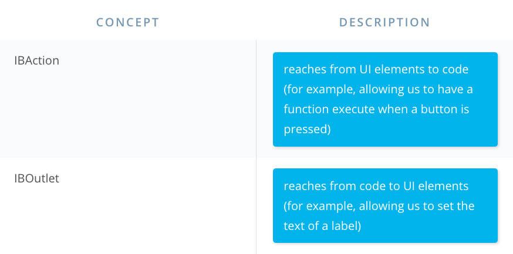

# iOS

## 專案目標

Build An App called Pitch Perfect that lets you record your voice and play it back with sound and effects.

需要一些基礎 IF statements loops and classes in Swift. We'll build on that foundation to show you how to write your first app.

### 會學到什麼

* Xcode\(從 Watch, Apple TV to iOS 到 Mac\)
* Audio Layouts and Buttons\(會刻一個畫面讓用戶錄音, set up the initial screen of the app for the user to record their own voice\)
  * how to lay out the user interface \(刻UI\)
  * how to connect UI elements such as our buttons to code
  * audio effects 會放一個入口讓用戶 can apply audio effects
* Delegation and Recording
  * how to pass the recorded audio from the first screen to the second
* Playback and Audio Effects
  * add the functionality for adding various alterations to the pitch

你將會得到：you'll be practicing fundamental iOS concepts that you can apply for any app that you build.

## 產品規劃

錄音介面

效果器

* 快速播放
* 加上星際大戰的音效 很搞笑
  * play it back with various sound effects
* 效果感覺可以搭配 resonance audio 做新增

Medium 筆記：[https://medium.com/@jeffreywang1183/ios-app-實作-pitch-perfect-音樂-4b85c6af35ea](https://medium.com/@jeffreywang1183/ios-app-實作-pitch-perfect-音樂-4b85c6af35ea)

感覺可以做成錄音後轉換成會議記錄，連結 Google document 可以有時間對照表

透過錄音快速製作會議記錄

Meeting transfer

## 筆記

* [document outline ](https://www.youtube.com/watch?v=3YnJEwNr3ck) 現在好像沒有
* [Xcode Shortcuts](https://classroom.udacity.com/courses/ud585/lessons/6994652511/concepts/9736c9fa-55ae-4c4b-b317-0ffcfcb80fae)

MVC

* view, controller, model
* view and model will tell the controller what they need
* MVC is used for iOS and Mac apps

開一個新專案

* 在 Xcode 開一個專案，選擇 Single view application\(open up a new project wizard, And then select a Single View Application\)
* Xcode 裡右上角的黃色箭頭可以做修復的動作
* simulator 會預設出現 TV out，[可以把它關掉](https://stackoverflow.com/questions/29721782/xcode-disable-tv-out-window)
* 可以從 window&gt;scale 去調整畫面大小

Add user interface elements in iOS

* build the first part of the Pitch Perfect app by adding and connecting buttons from an interface to code.
* How to add a UIbutton and setting up the text and background color.
* A system for positioning UI elements on screen called auto layout
  * layout constraints are the rules you give auto layout so that it can do its work
  * intrinsic size, that is they have a built in height and width.
  * then it only needs one additional constraint on each axis. iOS can automatically calculate the spacing on the remaining sides. You need a minimum of two constraints on each axis to properly lay out a UI element.
  * 至少知道要知道兩個方向的長度

2種加上 constraint 的方式

1. 用右下角的 align
2. 按下 control 拖拉物件到你要的 view 後藉由 dialog 去點選 constraint

I’m going to hold down the control key and click drag to the View. 

What is the difference between an IBOutlet and an IBAction?

IBActions trigger code to run, and IBOutlets let code affect the UI.

Application Lifecycle

* [很棒的影片](https://www.youtube.com/watch?time_continue=122&v=2U9_S0L8p_4)[https://www.youtube.com/watch?time\_continue=122&v=2U9\_S0L8p\_4](https://www.youtube.com/watch?time_continue=122&v=2U9_S0L8p_4)

用 option key 在物件上點兩下，可以開文件

在 iOS 裡 Will function 比 Did function 早

